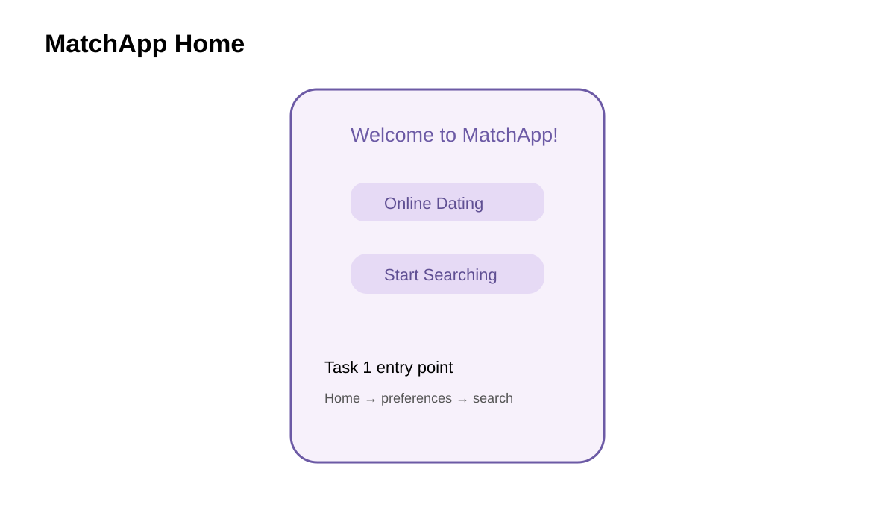

# MatchApp - Figma Interactive Dating App Prototype

A mobile-first interactive dating application prototype created in **Figma** for **ITIS 4350 - Rapid Prototyping (Summer 2024)**.

> **Project type:** Team UX/HCI prototyping project  
> **Platform:** Mobile  
> **Primary tool:** Figma  
> **Methods:** Wireframing, interaction design, task flows, usability testing  
> **My documented focus:** Task 1 - Basic Search

## Overview

**MatchApp** is a mobile dating-app prototype designed to help users discover potential matches, review profiles, communicate, and participate in lightweight get-to-know-you activities.

The team prototyped four connected workflows:

1. **Basic Search** - set match preferences, save them, search, and refine results
2. **Detailed Review** - review potential matches and choose match, pass, or save for later
3. **Communication** - exchange text and video messages with matches
4. **Get-to-Know-You Activities** - play quizzes and games with matches

## My Contribution - Basic Search

My primary responsibility was **Task 1: Basic Search**. I designed the search experience that allows users to define what they are looking for and progressively refine potential matches.

Key interactions included:

- Welcoming homepage and entry point into search
- Age-range selection using a slider
- Hobby and interest selection using checkboxes
- Saving preferences with confirmation feedback
- Viewing potential matches through profile cards
- Applying filters for distance, interests, education, and profession
- Advanced filtering and sorting
- Loading and progress feedback
- Navigation between preference, filter, and results screens

## Interactive Figma Prototype

[**View Project 4 in Figma**](https://www.figma.com/design/dBD3nT3FWctTsd7YfpqxfK/Project-4?node-id=69-346&t=tfQ6zGrF9NB9vJNy-1)

The Figma file contains the interactive team prototype. This repository focuses on documenting the project and clearly identifying my individual contribution.

## Prototype Preview

### Home Page

The home screen introduces MatchApp, provides a clear entry point into search, and establishes the app's navigation and visual identity.

## Task 1 Flow

**Home → Match Preferences → Save Preferences → Filters → Search Results → Advanced Filters**

The Basic Search flow was designed around progressive refinement: users first enter broad preferences, then narrow the results using additional criteria rather than facing every option at once.

## Design Patterns and UX Concepts

The Task 1 prototype used several common mobile interaction patterns:

- **Form layout** for organizing preference inputs
- **Slider control** for selecting an age range
- **Checkbox selection** for choosing multiple hobbies
- **Modal / confirmation feedback** for saving preferences
- **Card-based UI** for presenting potential matches
- **Loading feedback** to communicate system status
- **Filtering and sorting** for refining search results
- **Consistent navigation** across the mobile experience

## User Study

The team tested the prototype with **four participants**.

Feedback related to Basic Search included:

- The interface was generally viewed as clean and easy to navigate.
- The age-range slider and hobby checkboxes were straightforward to use.
- Advanced filters were useful for refining search results.
- Profile cards made basic information easy to scan.
- Users suggested onboarding or a short tutorial to explain the app's capabilities.
- Tooltips or brief explanations could clarify how individual filters affect results.
- A clearer way to reset preferences would improve repeated searches.
- Some layout and alignment issues could be refined for greater consistency.

## Design Process

1. **Research and inspiration** - reviewed existing dating applications and mobile search/filter patterns.
2. **Sketching** - created early paper wireframes for the Basic Search experience.
3. **Figma prototyping** - translated the flow into interactive mobile screens.
4. **Interaction design** - connected sliders, checkboxes, confirmation states, profile cards, and advanced filters.
5. **Usability testing** - observed users completing the task and collected feedback.
6. **Reflection** - identified opportunities for onboarding, stronger guidance, clearer alignment, and additional feedback.

## Tools and Skills

- Figma
- UX / HCI design
- Rapid prototyping
- Mobile interface design
- Wireframing
- Interaction design
- User-flow design
- Design patterns
- Usability testing
- User feedback synthesis
- Iterative design
- Team collaboration

## Repository Contents

| Path | Description |
| --- | --- |
| `README.md` | Portfolio-oriented overview of the MatchApp project |
| `PROJECT_INFO.md` | Course, team, Figma link, and contribution information |
| `prototype/FIGMA_LINK.md` | Direct link and notes for the interactive Figma prototype |
| `assets/` | Portfolio preview visuals used in this README |

## Team

This was a collaborative team project completed by:

- **Qudrat Siyal** - documented focus: Basic Search
- Aaron Rovnak
- Ayisha Riaz
- Chris Parker

The repository presents the complete product concept while distinguishing my documented contribution from the work completed by the rest of the team.

## What I Learned

This project strengthened my ability to move from sketches to a higher-fidelity interactive prototype in Figma. Designing the Basic Search flow gave me practical experience with progressive filtering, form controls, profile-card layouts, system feedback, and mobile navigation.

The usability study also reinforced that a working interaction is only part of a good user experience. Users still need clear guidance, consistent layouts, useful feedback, and understandable controls. Testing the prototype made those improvement opportunities much easier to identify before development.
